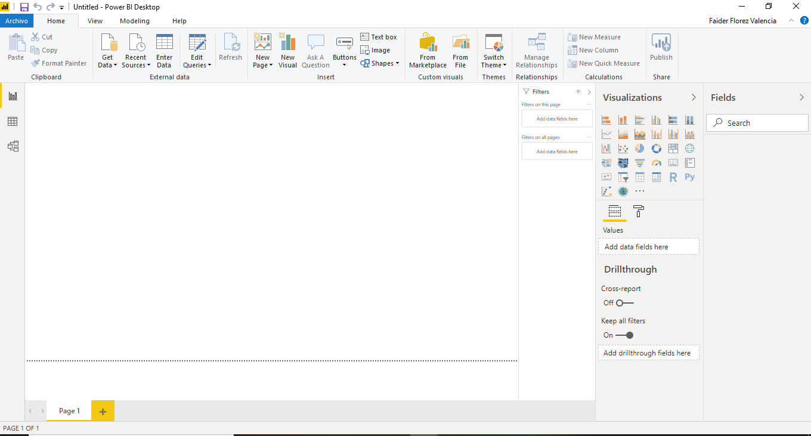
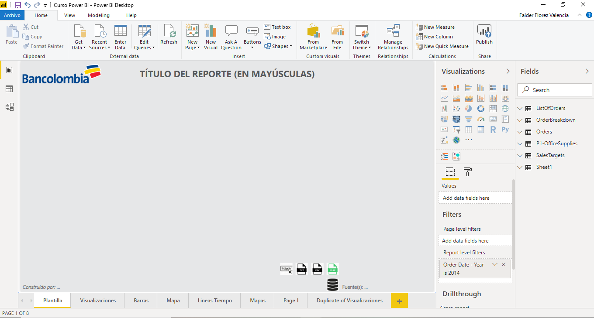
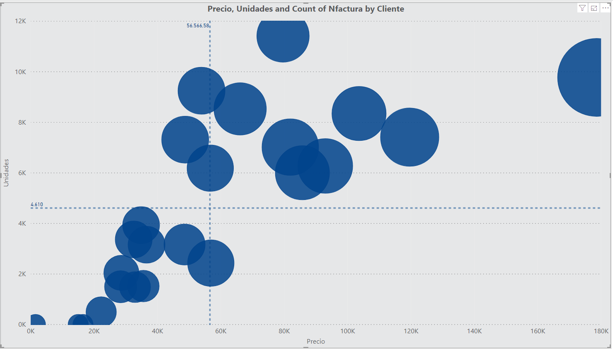
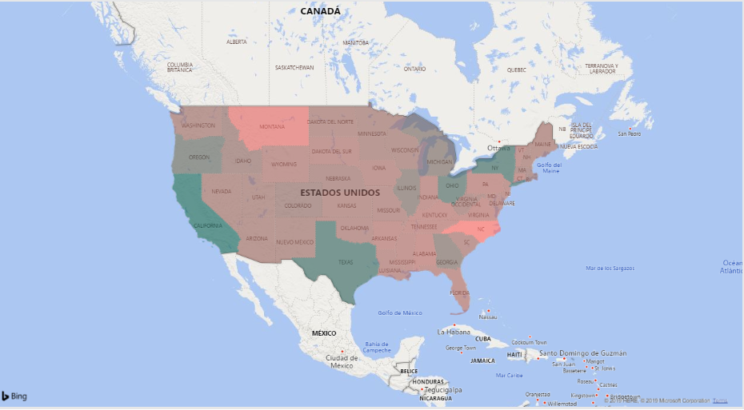
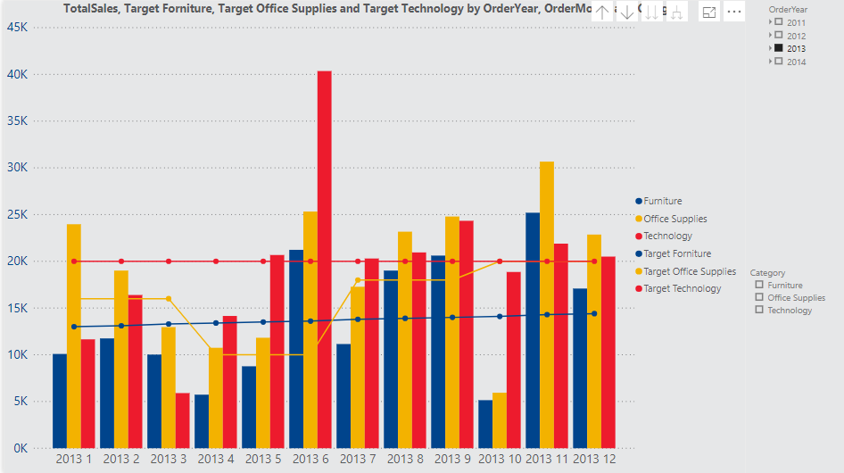
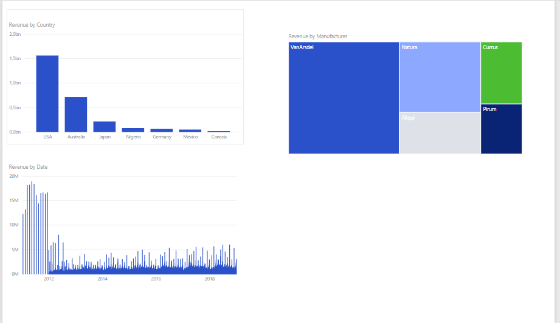
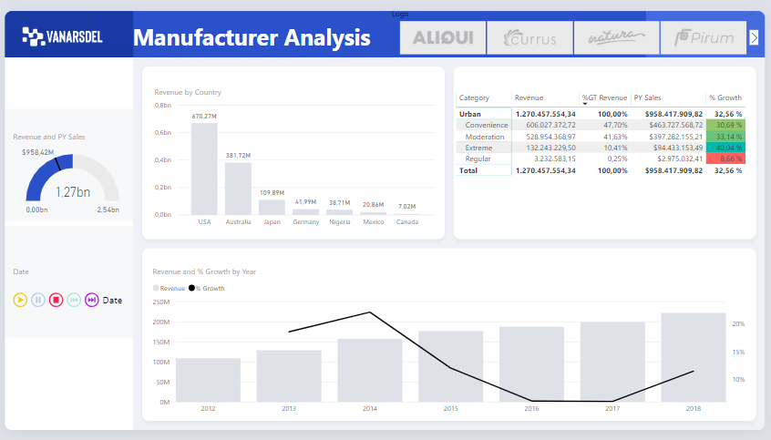

# <u>**Power BI**</u>

1. Primeros Pasos

   Instalación de Power BI:

   ​	En caso de no tenerlo se puede descargar de la ruta: https://powerbi.microsoft.com/es-es/desktop

2. Interfaz Grafica y componentes : 

   Algunos de los principales componentes de un tablero de Power BI son las fuentes de datos, las páginas,  los campos,  las visualizaciones y los menús.

   

   Editor de Power Query:

   

   Relaciones:

   

   Campos: 

   Dimensiones: Independientes 

   Medidas: Dependientes

   

3. Utilización de Plantillas

   Para el banco utilizaremos las plantillas que se encuentran en la ruta: [Plantillas](http://comunidades.bancolombia.corp/Expertos/Paginas/00_BAT%20SubPaginas/Reporter%C3%ADa.aspx)

   Para este curso tomaremos las mas actualizadas de la ruta: [PowerBI Plantillas y Temas](Plantillas-Temas)

   


4. **Visualizaciones:** 

   Fuente de Datos:  [DATOS.xlsx](Datos/DATOS.xlsx)

   Actividades:

   ​	Obtener datos desde el archivo:


- **Tablas y Matrices:**

  Preguntas de negocio:

  - ¿Cuantas son las unidades vendidas por departamento y el porcentaje equivalente por cada uno?

    

  

  - ¿Cuantas son las unidades vendidas por tipo de articulo y el porcentaje equivalente por cada uno?

    

  - ¿Cuantas son las unidades compradas por cliente y el porcentaje equivalente por cada uno?}

    

  - ¿Cuantas son las unidades vendidas por departamento en cada zona y el porcentaje equivalente por cada uno?

    

- **Diferentes tipos de visualización:**

  Estableciendo una descripción del negocio  a través del tiempo que nos permita revisar el total de unidades, tipos de artículos y  clientes.

  Para esto podemos crear **graficas de torta** (pie charts), **gráficos de barras** (bar charts) y **gráficos de líneas** entre muchos otros.

  
  
  
  
  También se puede realizar segmentación de clientes de acuerdo a las unidades compradas  y la utilidad que le presenta a la compañía.
  
  Unos gráficos que nos permiten ver este tipo de segmentación son los gráficos de dispersión (scatter chart) 
  
  
  
  
  
  


* # **Series de tiempo:** (REVISAR)

  Fuente:  [P1-Long-Term-Unemployment-Statistics.xlsx](Datos/P1-Long-Term-Unemployment-Statistics.xlsx)

  Importar los datos. Revisar los pasos que automáticamente hace Power BI.

* **Line Chart**

  Construir el siguiente grafico:

  

  **Actividades:** 

  Crear grafico de líneas para series de tiempo Unemployment por Periodo 
  Visualizar por Año, Mes, Año - Mes unidos - Diferenciar Jerarquías de Periodo
  Visualizar en Area Chart
  Adicionar Gender para tener dos líneas comparativas
  Cambiar el estilo de los Shapes (Líneas) y Markers
  Agregar o cambiar a Age
  Cambiar SUM por AVG en los values (Unemployed)
  Crear Stacked area con Periodo y Age y mirar Legendas

  

  

* **Mapas:** 

  Fuente: [P1-SuperStoreUS-2015.xlsx
  ](Datos/P1-SuperStoreUS-2015.xlsx
  )

  Construir el siguiente grafico:

  

  

  **Actividades:** 

  Fill Map con la BD de Ordenes - Country + State of Province con Conditional formatting 

  

* Relaciones: 

  Fuente: [AmazingMartEU2.xlsx](Datos/P1-AmazingMartEU2.xlsx)

  Construir el siguiente grafico:

  

  **Actividades:**

  Configurar relaciones en P1-AmazingMartEU2.xlsx entre: ListOfOrders y OrderBreakdown

  Crear Jerarquias: Geography: Countr + State + City
  Pintar en el mapa.
  Crear una nuevo dato calculado (Measure):

   Profit Margin = Sum(OrderBreakdown[Profit])/ sum(OrderBreakdown[Sales]) 

  Data Color dependiente del Profit Margin

  

  

* **Joins:**

  Fuentes: [P1-Airline-Comparison.xlsx](Datos/P1-Airline-Comparison.xlsx)

  Construir el siguiente grafico:

  

  **Actividades:**

  Comparar los datos de Airline1 y Airline1.

  Eliminar columnas

  Cambiar nombre de variables

  Crear nueva fuente de datos a partir de un Merge (Joins) y revisar los Appends (Unions)

  

* **Cálculos y Medidas**

  Fuente: [P1-AmazingMartEU2.xlsx](Datos/P1-AmazingMartEU2.xlsx)

  Construir el siguiente grafico:

  

  


​		**Actividades:**

​		Crear un join entre las tablas ListOfOrders y OrderBreakdown

​		Crear una agrupación por categoría + Año + Mes

​		Crear un join entre la tabla resultante y la tabla SalesTargets

​		Crear las medidas:

​	 	 	

```MDX
Target Forniture = CALCULATE(sum('ListOfOrders+OrderBreakdown'[Target]);'ListOfOrders+OrderBreakdown'[Category]=="Furniture")

Target Office Supplies = 	CALCULATE(sum('ListOfOrders+OrderBreakdown'[Target]);'ListOfOrders+OrderBreakdown'[Category]=="Office Supplies")

Target Technology = 	CALCULATE(sum('ListOfOrders+OrderBreakdown'[Target]);'ListOfOrders+OrderBreakdown'[Category]=="Technology")
```

​	

5. **Proceso **


6. **Reto:**

Utilizando el archivo: [Reto](Archivo/Reto-Report.pbix)

Construir las siguientes paginas: 







