# <u>**Taller Power BI**</u>

1. ###### Primeros Pasos

   Instalación de Power BI:

   ​	En caso de no tenerlo se puede descargar de la ruta: https://powerbi.microsoft.com/es-es/desktop

2. ###### Interfaz Grafica y componentes : 

   Algunos de los principales componentes de un tablero de Power BI son las fuentes de datos, las páginas,  los campos,  las visualizaciones y los menús.

   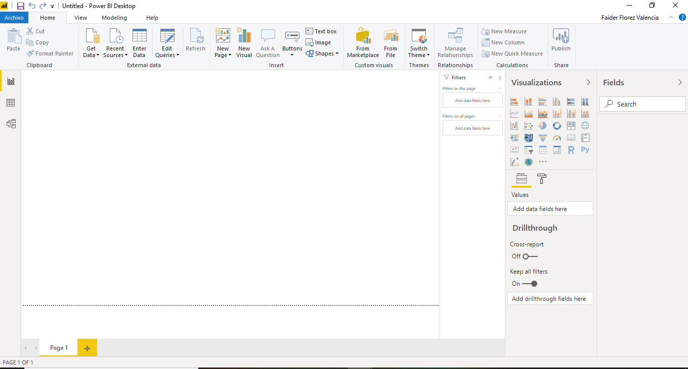

   Editor de Power Query:

   

   Relaciones:

   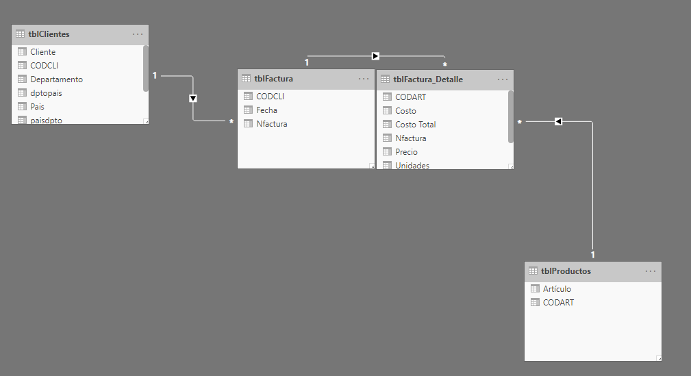

   Campos: 

   Dimensiones: Independientes 

   Medidas: Dependientes

   

3. ###### Utilización de Plantillas

   Para este curso tomaremos un ejemplo de una plantilla que se encuentra en la ruta: [PowerBI Plantillas](Plantillas)

   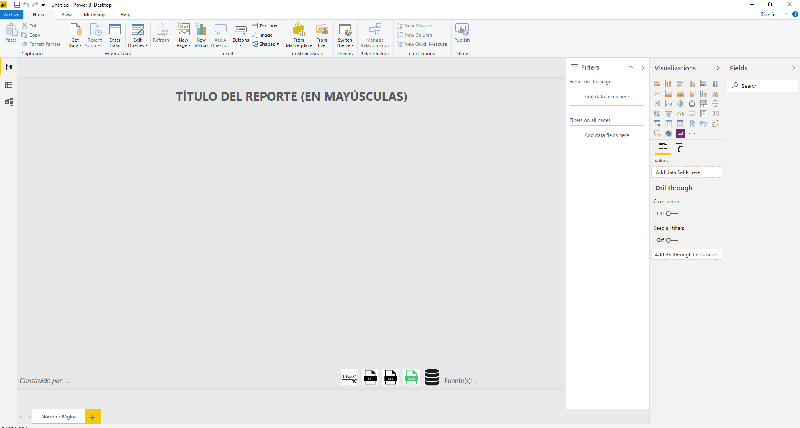


4. **Visualizaciones:** 

   Fuente de Datos:  [Base_EntrenamientoPBI.xlsx](Datos/Base_EntrenamientoPBI.xlsx)

   Actividades:

   ​	Obtener datos desde el archivo:


**Tablas y Matrices:**

Preguntas de negocio:

- ¿Cuantas son las unidades vendidas por departamento y el porcentaje equivalente por cada uno?

  
  
  - Crear la tabla.
  - Ordenar por numero de unidades
  - Generar porcentaje del total
  - Formato condicional sobre el porcentaje con el fondo de las celdas.
  - Mostrar y quitar totales.


- ¿Cuantas son las unidades vendidas por tipo de articulo y el porcentaje equivalente por cada uno?

  - Crear la tabla.
  - Ordenar por numero de unidades
  - Generar porcentaje del total
  - Formato condicional sobre el porcentaje con barras.
  - Mostrar y quitar totales.

  

- ¿Cuantas son las unidades compradas por el top 5 de clientes y el porcentaje equivalente por cada uno?

  - Crear la tabla.

  - Ordenar por numero de unidades

  - Generar porcentaje del total

  - Formato condicional sobre el porcentaje con el color de fuente.

  - Mostrar y quitar totales.

  - Mostrar el top 5 de clientes.

  - Crear filtro por clientes, modificarlo con búsquedas, seleccionar todos, cambiar a formato de lista desplegable.

    

  

- ¿Cuantas son las unidades vendidas por departamento en cada zona y el porcentaje equivalente por cada uno?

  
  
  - Crear una tabla manual en POWER BI
  - Hacer el merge (Join) con la tabla de Productos 
  - Crear la matriz.
  - Agregar en filas el departamento y zonas y en columnas la categorías de productos
  - Generar porcentaje del total
  - Formato condicional.
  - Mostrar y quitar totales.
  
  

**Diferentes tipos de visualización:**

Estableciendo una descripción del negocio  a través del tiempo que nos permita revisar el total de unidades, tipos de artículos y  clientes.

Para esto podemos crear **graficas circular** (pie charts), **gráficos de barras** (bar charts) y **gráficos de líneas** entre muchos otros.	

###### Grafica circular

- Crear grafico circular
- Mostrar leyendas en todas las posiciones con los colores respectivos.
- Ordenar por numero de unidades
- Agregar numero y porcentaje correspondiente.
- Modificar el titulo y sus propiedades.
- Mostrar el grafico de anillos como alternativa.

###### Grafico de barras

+ Crear grafico de barras
+ Ordenarlo por numero de unidades
+ Ponerle etiqueta de unidades en la base inferior
+ Cambiar el formato de las etiquetas y barras en tamaño y fuente.
+ Modificar el titulo y sus propiedades

###### Grafico de líneas  

+ Crear grafico de líneas
+ Convertir la fecha a jerarquías y mostrar las opciones de drill down 
+ Mostrar y modificar leyendas.
+ Modificar el titulo y sus propiedades
+ Crear grafico con totales y crear lineal analítica de proyección. 

###### Filtros

+ Crear filtro por fechas y mostrar alternativas 
+ Crear filtro por artículos
+ Crear filtros por cliente

###### Tarjetas

+ Crear tarjeta de total de unidades
+ Crear tarjeta de total de artículos
+ Crear tarjeta de numero de clientes
+ Crear filtro por clientes, modificarlo con búsquedas, seleccionar todos, cambiar a formato de lista desplegable.

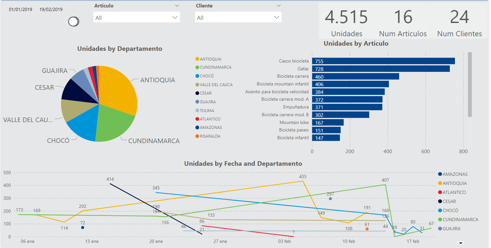


###### Segmentación 

También se puede realizar segmentación de clientes de acuerdo a las unidades compradas  y la utilidad que le presenta a la compañía.

Unos gráficos que nos permiten ver este tipo de segmentación son los gráficos de dispersión (scatter chart) 

+ Crear grafico de dispersión precio vs unidades en cada cliente 

+ Mostrar tamaño de acuerdo al numero de facturas 

+ Agregar tooltips 

+ Crear líneas de promedio de precio y numero de unidades

+ Leyendas por departamento

  

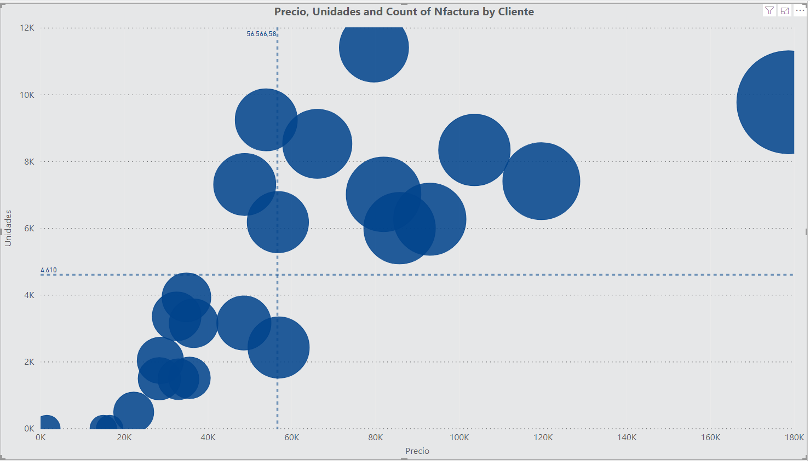

###### Métricas y nuevas columnas

+ Crear columna de ventas total por facturas: 

  *Venta Total = tblFactura_Detalle[Unidades]*tblFactura_Detalle[Precio]*

+ Crear columna de costo total por facturas: 

  *Costo Total = tblFactura_Detalle[Unidades]*tblFactura_Detalle[Costo]*

+ Crear columna de utilidades: 

  *Utilidades = tblFactura_Detalle[Venta Total]-tblFactura_Detalle[Costo Total]*

+ Crear grafico que muestre la dispersión de Utilidades vs Unidades

+ Crear filtro por cliente 

+ Crear líneas de promedio por cada eje.

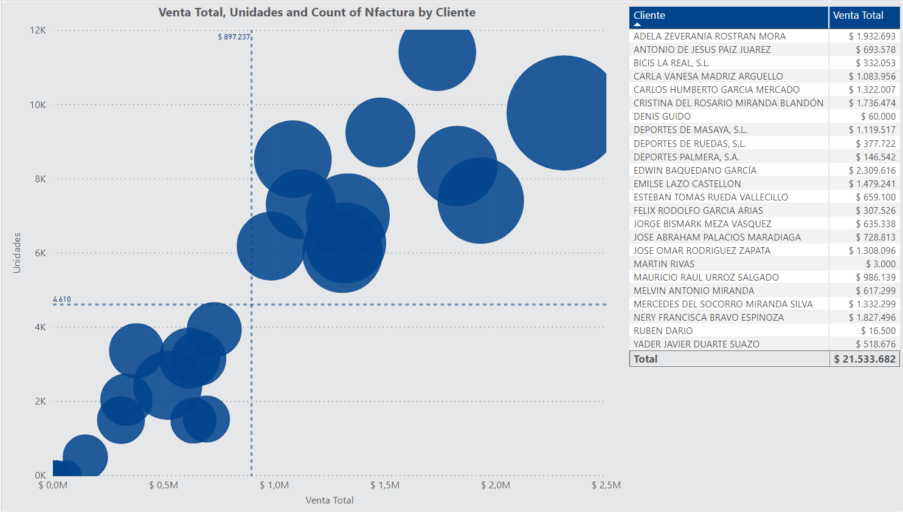


###### Series de tiempo 

Fuente:  [P1-Long-Term-Unemployment-Statistics.xlsx](Datos/P1-Long-Term-Unemployment-Statistics.xlsx)

Importar los datos. Revisar los pasos que automáticamente hace Power BI.

* **Line Chart**

  Construir el siguiente grafico:

  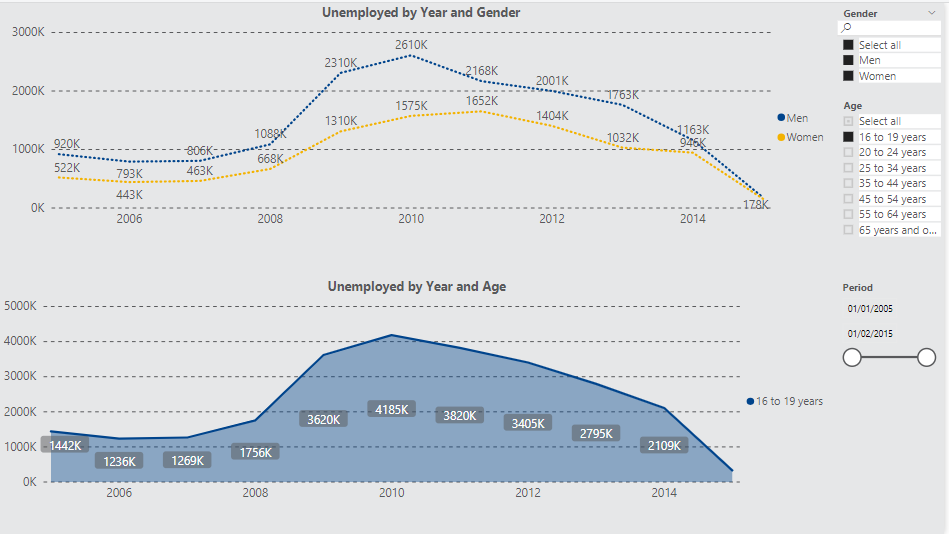

  

* Crear grafico de líneas para series de tiempo Unemployment por Periodo 

* Visualizar por Año, Mes, Año - Mes unidos - Diferenciar Jerarquías de Periodo

* Visualizar por Año, Mes, Año - Mes unidos - Diferenciar Jerarquías de Periodo

* Visualizar por Año, Mes, Año - Mes unidos - Diferenciar Jerarquías de Periodo

* Visualizar en Area Chart

* Adicionar Gender para tener dos líneas comparativas

* Cambiar el estilo de los Shapes (Líneas) y Markers

* Agregar o cambiar a Age

* Cambiar SUM por AVG en los values (Unemployed)

* Crear Stacked area con Periodo y Age y mirar Legendas

  

  

**Mapas:** 

Fuente: [P1-SuperStoreUS-2015.xlsx
](Datos/P1-SuperStoreUS-2015.xlsx
)

Construir el siguiente grafico:


Fill Map con la BD de Ordenes - Country + State of Province con Conditional formatting 

###### Relaciones

Fuente: [AmazingMartEU2.xlsx](Datos/P1-AmazingMartEU2.xlsx)

Construir el siguiente grafico:

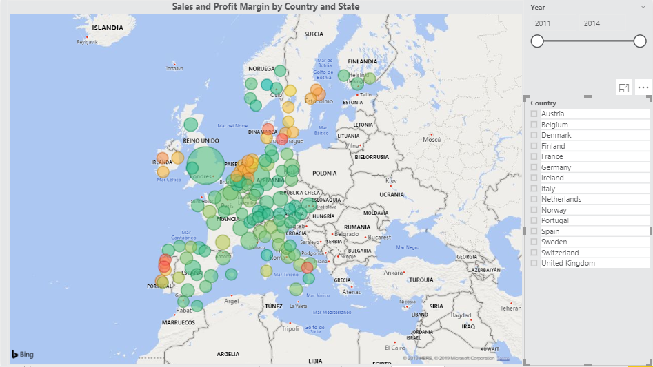


Configurar relaciones en P1-AmazingMartEU2.xlsx entre: ListOfOrders y OrderBreakdown

Crear Jerarquias: Geography: Countr + State + City
Pintar en el mapa.
Crear una nuevo dato calculado (Measure):

 Profit Margin = Sum(OrderBreakdown[Profit])/ sum(OrderBreakdown[Sales]) 

Data Color dependiente del Profit Margin


###### Joins

Fuentes: [P1-Airline-Comparison.xlsx](Datos/P1-Airline-Comparison.xlsx)

Construir el siguiente grafico:

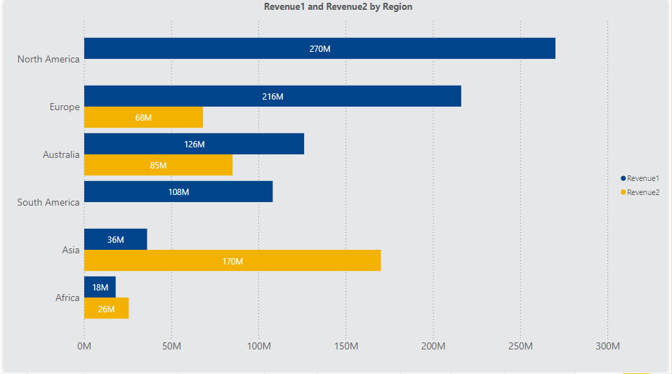


Comparar los datos de Airline1 y Airline1.

Eliminar columnas

Cambiar nombre de variables

Crear nueva fuente de datos a partir de un Merge (Joins) y revisar los Appends (Unions)


**Cálculos y Medidas**

Fuente: [P1-AmazingMartEU2.xlsx](Datos/P1-AmazingMartEU2.xlsx)

Construir el siguiente grafico:


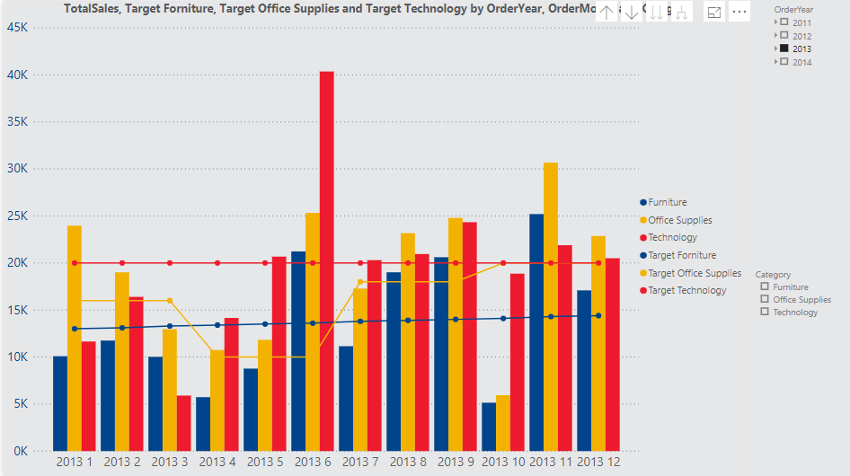


Crear un join entre las tablas ListOfOrders y OrderBreakdown

Crear una agrupación por categoría + Año + Mes

Crear un join entre la tabla resultante y la tabla SalesTargets

Crear las medidas:

​	 	 	

```MDX
Target Forniture = CALCULATE(sum('ListOfOrders+OrderBreakdown'[Target]);'ListOfOrders+OrderBreakdown'[Category]=="Furniture")

Target Office Supplies = 	CALCULATE(sum('ListOfOrders+OrderBreakdown'[Target]);'ListOfOrders+OrderBreakdown'[Category]=="Office Supplies")

Target Technology = 	CALCULATE(sum('ListOfOrders+OrderBreakdown'[Target]);'ListOfOrders+OrderBreakdown'[Category]=="Technology")
```

​	

###### 5. Reto:

Utilizando el archivo: [Reto](Archivo/Reto-Report.pbix)

Construir las siguientes paginas: 

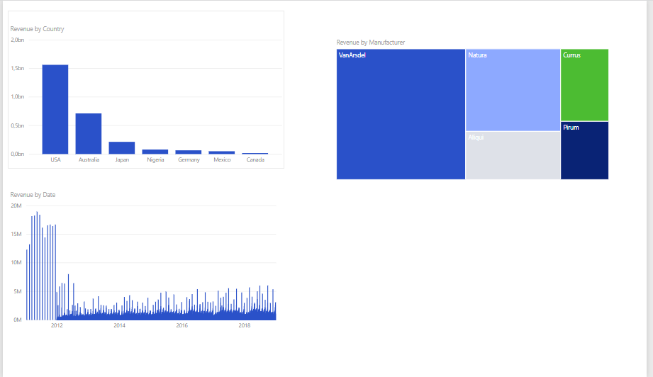


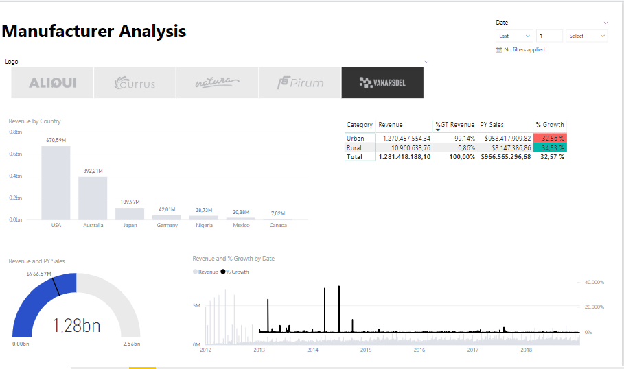


