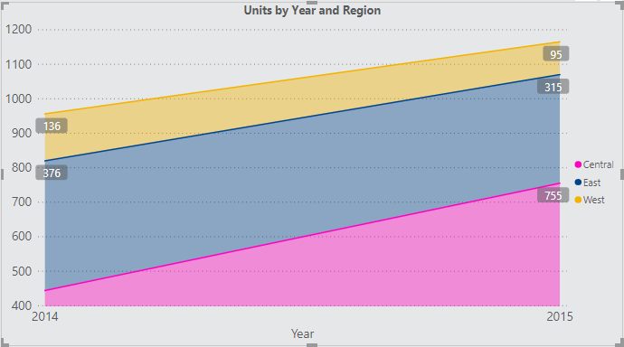
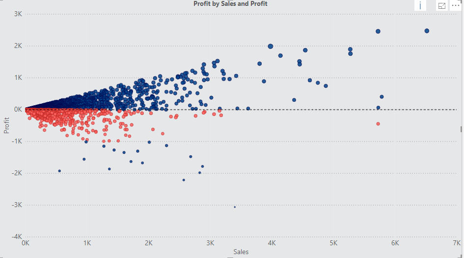
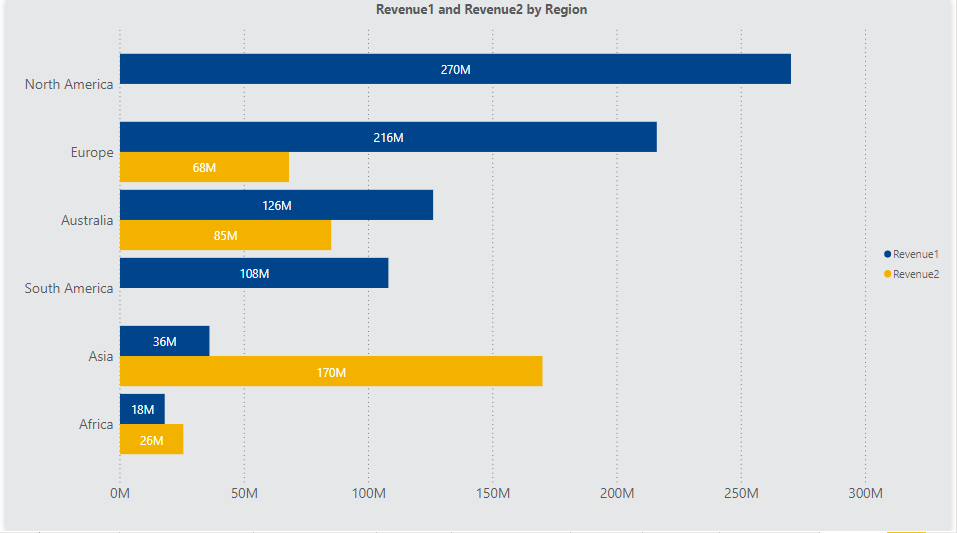

# <u>**Power BI**</u>

1. Primeros Pasos

   Instalación de Power BI:

   ​	En caso de no tenerlo se puede descargar de la ruta: https://powerbi.microsoft.com/es-es/desktop

2. Interfaz Grafica y componentes : Revisar fuentes de datos, Paginas, Campos, Visualizaciones, Guardar archivo, Menús.

   

   Editor de Power Query:

   

   

   Campos: 

   Dimensiones: Independientes 

   Medidas: Dependientes

   

3. Utilización de Plantillas

   Para el banco utilizaremos las plantillas que se encuentran en la ruta: [Plantillas Banco](http://comunidades.bancolombia.corp/Expertos/Paginas/00_BAT%20SubPaginas/Reporter%C3%ADa.aspx)

   Para este curso tomaremos las mas actualizadas de la ruta: [PowerBI Plantillas y Temas](Plantillas-Temas)

   


4. Visualizaciones: 

   Fuente de Datos:  [P1-OfficeSupplies.csv](Datos/P1-OfficeSupplies.csv)

   Actividades:

   ​	Obtener datos desde el archivo:


- **Tablas y Matrices:**

  Construir las siguientes visualizaciones:

  

  

- **Diferentes tipos de visualización:**

  Visualizar tabla de Regiones por Unidades y cambiar rápidamente por grafico de barras, luego graficas circulares (Grafico de torta), treeMap y luego a bubble chart  del MarketPlace, entre otros.

  Construir el siguiente grafico Stacked Chart de OrdesDate(Axis) vs Region (Legends) y Units(Values): 

  


- **Barras:**

  Construir el siguiente grafico:

  

  **Actividades:**

  Crear Bar chart con REP(Axis) y Units(Value) - Add Region
  Revisar la acciones del drill down 
  Crear nueva columna: TotalSales = 'P1-OfficeSupplies'[Units]* 'P1-OfficeSupplies'[Unit Price]
  Cambios de colores
  Múltiples colores por Legenda (Rep)
  Cambiar colores de acuerdo al Theme
  Color dependiente de la nueva columna Rojo a Verde (Conditional formatting)
  Cambiar valor dependiente de Region
  Adicionar Labels o Etiquetas para el campo Valor (Data Labels) y cambiar a tipo moneda.
  Modificar estilos de X-axis y Y-axis

  

* **Series de tiempo:**

  Fuente:  [P1-Long-Term-Unemployment-Statistics.xlsx](Datos/P1-Long-Term-Unemployment-Statistics.xlsx)

  Importar los datos. Revisar los pasos que automáticamente hace Power BI.

* **Line Chart**

  Construir el siguiente grafico:

  

  **Actividades:** 

  Crear grafico de líneas para series de tiempo Unemployment por Periodo 
  Visualizar por Año, Mes, Año - Mes unidos - Diferenciar Jerarquías de Periodo
  Visualizar en Area Chart
  Adicionar Gender para tener dos líneas comparativas
  Cambiar el estilo de los Shapes (Líneas) y Markers
  Agregar o cambiar a Age
  Cambiar SUM por AVG en los values (Unemployed)
  Crear Stacked area con Periodo y Age y mirar Legendas

* **Filtros**

  A nivel Visual

  A nivel Pagina

  A nivel reporte

  Básicos y avanzados
  Filtro por Age y filtro visible (List, Dropdown, Search)
  Filtro por Age y Filtro Herarquico (HierarchySlicer)
  Filtros por interacción

  

* **Mapas:** 

  Fuente: [P1-SuperStoreUS-2015.xlsx
  ](Datos/P1-SuperStoreUS-2015.xlsx
  )

  Construir el siguiente grafico:

  

  

  **Actividades:** 

  Fill Map con la BD de Ordenes - Country + State of Province con Conditional formatting 

  

* Relaciones: 

  Fuente: [AmazingMartEU2.xlsx](Datos/P1-AmazingMartEU2.xlsx)

  Construir el siguiente grafico:

  

  **Actividades:**

  Configurar relaciones en P1-AmazingMartEU2.xlsx entre: ListOfOrders y OrderBreakdown

  Crear Jerarquias: Geography: Countr + State + City
  Pintar en el mapa.
  Crear una nuevo dato calculado (Measure):

   Profit Margin = Sum(OrderBreakdown[Profit])/ sum(OrderBreakdown[Sales]) 

  Data Color dependiente del Profit Margin

  

* **Scatterplots:** 

  Construir el siguiente grafico:

  

  **Actividades:**

  Profit vs Sales y por Customer Name

  Filtro en Report 
  Modificar Scatterplots y añadir linea analítica y datos en rojo y verde por encima y debajo de cero. 

* **Joins:**

  Fuentes: [P1-Airline-Comparison.xlsx](Datos/P1-Airline-Comparison.xlsx)

  Construir el siguiente grafico:

  

  **Actividades:**

  Comparar los datos de Airline1 y Airline1.

  Eliminar columnas

  Cambiar nombre de variables

  Crear nueva fuente de datos a partir de un Merge (Joins) y revisar los Appends (Unions)

  

* **Cálculos y Medidas**

  Fuente: [P1-AmazingMartEU2.xlsx](Datos/P1-AmazingMartEU2.xlsx)

  Construir el siguiente grafico:

  

  


​		**Actividades:**

​		Crear un join entre las tablas ListOfOrders y OrderBreakdown

​		Crear una agrupación por categoría + Año + Mes

​		Crear un join entre la tabla resultante y la tabla SalesTargets

​		Crear las medidas:

​	 	 	

```MDX
Target Forniture = CALCULATE(sum('ListOfOrders+OrderBreakdown'[Target]);'ListOfOrders+OrderBreakdown'[Category]=="Furniture")

Target Office Supplies = 	CALCULATE(sum('ListOfOrders+OrderBreakdown'[Target]);'ListOfOrders+OrderBreakdown'[Category]=="Office Supplies")

Target Technology = 	CALCULATE(sum('ListOfOrders+OrderBreakdown'[Target]);'ListOfOrders+OrderBreakdown'[Category]=="Technology")
```

​	

5. **Proceso Banco**


6. **Exportar**

   PDF

   csv

   Excel

   Power Point

   Recortes

7. **Publicar** 

   Archivo

   Nube

   Reporting

   Dashboard y reportes

   

8. **Reto:**

   Utilizando el archivo: [Reto](Archivo/Reto-Report.pbix)

   Construir las siguientes paginas: 

   

   

   

   